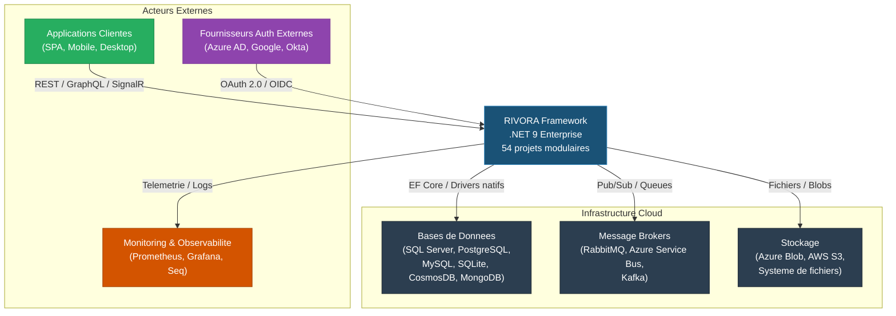
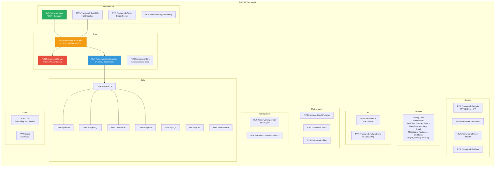
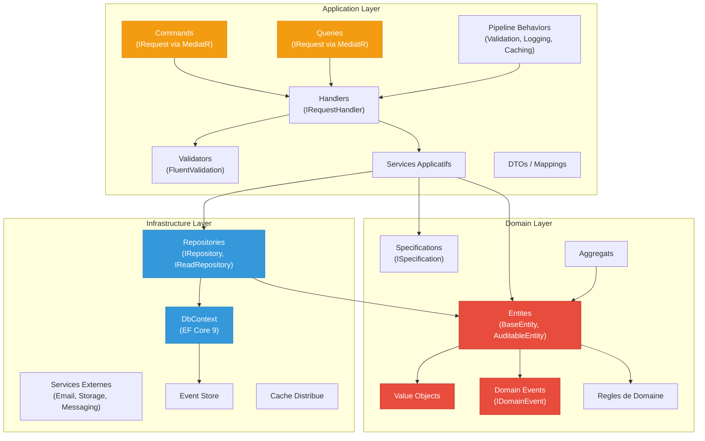
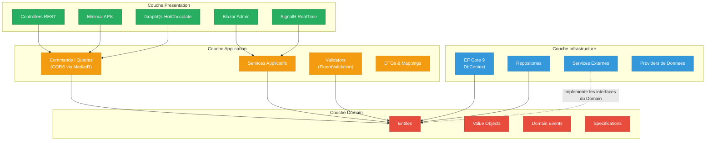
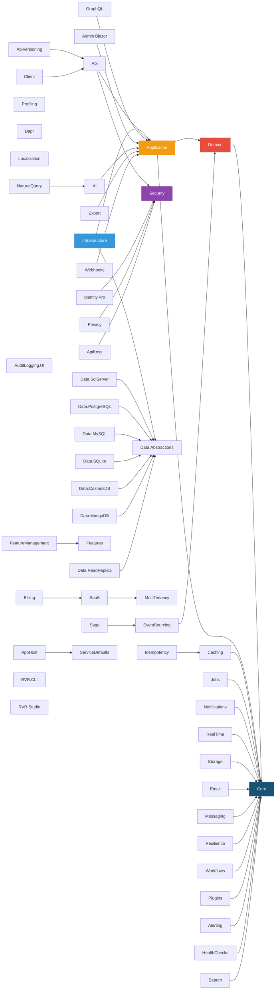
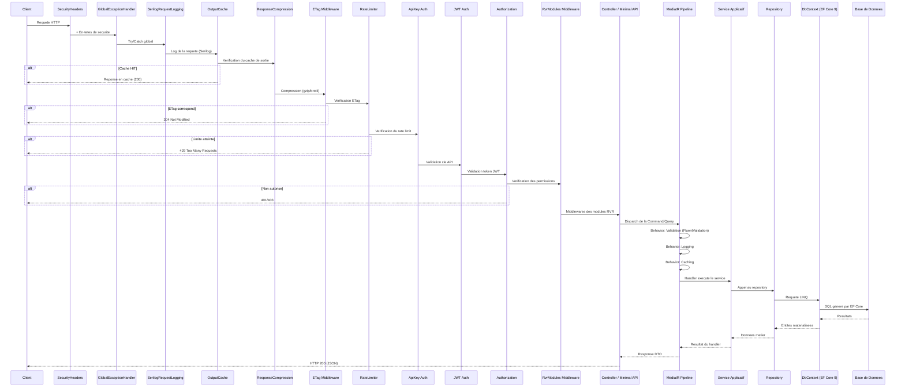
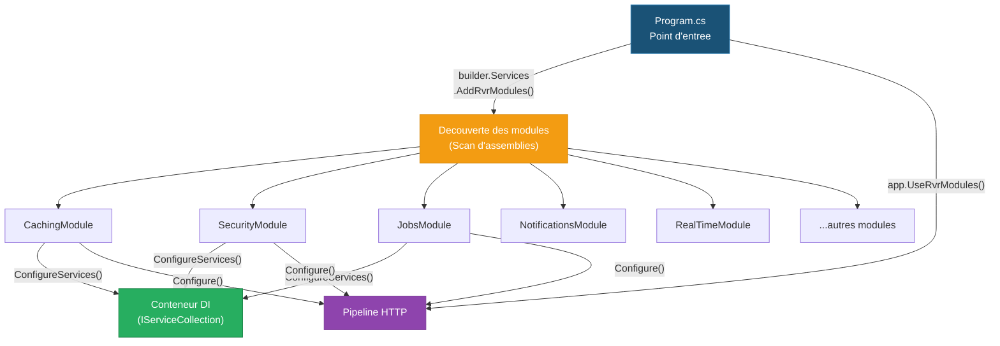

# RIVORA Framework - Architecture Technique

> **Version** : 3.1.0 | **.NET 9** | **Clean Architecture** | **54 projets**
>
> Ce document permet a un architecte de comprendre la structure complete du framework en moins de 10 minutes.

---

## Table des matieres

1. [Vue d'ensemble](#1-vue-densemble)
2. [C4 Niveau 1 - Contexte Systeme](#2-c4-niveau-1---contexte-systeme)
3. [C4 Niveau 2 - Conteneurs](#3-c4-niveau-2---conteneurs)
4. [C4 Niveau 3 - Composants du Core](#4-c4-niveau-3---composants-du-core)
5. [Couches DDD](#5-couches-ddd)
6. [Carte des dependances inter-modules](#6-carte-des-dependances-inter-modules)
7. [Flux d'une requete HTTP](#7-flux-dune-requete-http)
8. [Architecture modulaire - Pattern IRvrModule](#8-architecture-modulaire---pattern-irvrmodule)
9. [Inventaire complet des 54 projets](#9-inventaire-complet-des-54-projets)

---

## 1. Vue d'ensemble

RIVORA est un framework entreprise .NET 9 fonde sur les principes de **Clean Architecture** et **Domain-Driven Design**. Il fournit une base modulaire couvrant l'ensemble des besoins d'une application SaaS moderne : API REST/GraphQL, multi-tenancy, securite avancee, intelligence artificielle, event sourcing, et bien plus.

**Regle fondamentale** : les dependances pointent toujours vers l'interieur. Le Domain ne depend de rien.

---

## 2. C4 Niveau 1 - Contexte Systeme

Ce diagramme montre RIVORA dans son ecosysteme, avec les acteurs externes qui interagissent avec lui.



---

## 3. C4 Niveau 2 - Conteneurs

Vue des grands conteneurs/couches qui composent le framework.



---

## 4. C4 Niveau 3 - Composants du Core

Zoom sur le coeur du framework : les interactions entre Domain, Application et Infrastructure.



---

## 5. Couches DDD

Representation visuelle des 4 couches de la Clean Architecture. Les dependances pointent **toujours vers l'interieur**.



**Legende des couleurs :**
- **Rouge** : Domain (aucune dependance externe)
- **Orange** : Application (depend uniquement du Domain)
- **Bleu** : Infrastructure (implemente les contrats du Domain)
- **Vert** : Presentation (point d'entree, depend de Application)

---

## 6. Carte des dependances inter-modules



---

## 7. Flux d'une requete HTTP

Pipeline complet du traitement d'une requete HTTP depuis le client jusqu'a la base de donnees.



---

## 8. Architecture modulaire - Pattern IRvrModule

Chaque module du framework implemente l'interface `IRvrModule`, definie dans `RVR.Framework.Core.Modules`.

### Interface IRvrModule

```csharp
public interface IRvrModule
{
    string Name { get; }
    void ConfigureServices(IServiceCollection services, IConfiguration configuration);
    void Configure(IApplicationBuilder app);
}
```

### Enregistrement des modules



**Principe** : chaque module est autonome. Il declare ses propres services et ses middlewares. L'application hote n'a qu'a appeler `AddRvrModules()` et `UseRvrModules()` pour activer l'ensemble des modules decouverts.

---

## 9. Inventaire complet des 54 projets

### Core (4 projets)

| Projet | Repertoire | Description |
|--------|-----------|-------------|
| `RVR.Framework.Core` | `src/core/` | Abstractions de base, interfaces `IRvrModule`, types communs |
| `RVR.Framework.Domain` | `src/core/` | Entites, Value Objects, Domain Events, Specifications |
| `RVR.Framework.Application` | `src/core/` | CQRS (MediatR), Services, Validators (FluentValidation), DTOs |
| `RVR.Framework.Infrastructure` | `src/core/` | EF Core 9, Repositories, implementation des contrats du Domain |

### Data Providers (8 projets)

| Projet | Repertoire | Description |
|--------|-----------|-------------|
| `RVR.Framework.Data.Abstractions` | `src/data/` | Interfaces et contrats pour les providers de donnees |
| `RVR.Framework.Data.SqlServer` | `src/data/` | Provider SQL Server |
| `RVR.Framework.Data.PostgreSQL` | `src/data/` | Provider PostgreSQL |
| `RVR.Framework.Data.MySQL` | `src/data/` | Provider MySQL |
| `RVR.Framework.Data.SQLite` | `src/data/` | Provider SQLite |
| `RVR.Framework.Data.CosmosDB` | `src/data/` | Provider Azure CosmosDB |
| `RVR.Framework.Data.MongoDB` | `src/data/` | Provider MongoDB |
| `RVR.Framework.Data.ReadReplica` | `src/data/` | Routage lecture/ecriture pour replicas |

### Presentation (4 projets)

| Projet | Repertoire | Description |
|--------|-----------|-------------|
| `RVR.Framework.Api` | `src/api/` | API REST avec Swagger/OpenAPI |
| `RVR.Framework.GraphQL` | `src/api/` | API GraphQL via HotChocolate |
| `RVR.Framework.ApiVersioning` | `src/api/` | Versioning d'API |
| `RVR.Framework.Admin` | `src/ui/` | Interface d'administration Blazor Server |

### Securite (4 projets)

| Projet | Repertoire | Description |
|--------|-----------|-------------|
| `RVR.Framework.Security` | `src/security/` | JWT, BCrypt, 2FA, Rate Limiting |
| `RVR.Framework.Identity.Pro` | `src/security/` | Gestion avancee des identites |
| `RVR.Framework.Privacy` | `src/security/` | Conformite RGPD |
| `RVR.Framework.ApiKeys` | `src/modules/` | Authentification par cles API |

### Multi-tenancy (3 projets)

| Projet | Repertoire | Description |
|--------|-----------|-------------|
| `RVR.Framework.MultiTenancy` | `src/multitenancy/` | Isolation multi-locataire |
| `RVR.Framework.SaaS` | `src/multitenancy/` | Fonctionnalites SaaS (plans, limites) |
| `RVR.Framework.Billing` | `src/multitenancy/` | Facturation et abonnements |

### Intelligence Artificielle (2 projets)

| Projet | Repertoire | Description |
|--------|-----------|-------------|
| `RVR.Framework.AI` | `src/ai/` | RAG, integration LLM |
| `RVR.Framework.NaturalQuery` | `src/ai/` | Requetes en langage naturel vers LINQ |

### Modules (22 projets)

| Projet | Repertoire | Description |
|--------|-----------|-------------|
| `RVR.Framework.Caching` | `src/modules/` | Cache en memoire et distribue |
| `RVR.Framework.Jobs` | `src/modules/` | Jobs planifies (Abstractions + Hangfire + Quartz) |
| `RVR.Framework.Notifications` | `src/modules/` | Notifications multi-canal |
| `RVR.Framework.RealTime` | `src/modules/` | Communication temps reel (SignalR) |
| `RVR.Framework.Storage` | `src/modules/` | Stockage de fichiers (local, cloud) |
| `RVR.Framework.Features` | `src/modules/` | Feature flags |
| `RVR.Framework.FeatureManagement` | `src/modules/` | Gestion avancee des fonctionnalites |
| `RVR.Framework.HealthChecks` | `src/modules/` | Verifications de sante |
| `RVR.Framework.Localization.Dynamic` | `src/modules/` | Localisation dynamique |
| `RVR.Framework.EventSourcing` | `src/modules/` | Event Sourcing |
| `RVR.Framework.Saga` | `src/modules/` | Orchestration de sagas |
| `RVR.Framework.Email` | `src/modules/` | Envoi d'emails (SMTP, SendGrid) |
| `RVR.Framework.Messaging` | `src/modules/` | Bus de messages |
| `RVR.Framework.Resilience` | `src/modules/` | Polly, Circuit Breaker, Retry |
| `RVR.Framework.Idempotency` | `src/modules/` | Garantie d'idempotence |
| `RVR.Framework.Dapr` | `src/modules/` | Integration Dapr |
| `RVR.Framework.Profiling` | `src/modules/` | Profilage de performance |
| `RVR.Framework.Workflows` | `src/modules/` | Moteur de workflows |
| `RVR.Framework.Plugins` | `src/modules/` | Systeme de plugins |
| `RVR.Framework.Search` | `src/modules/` | Recherche full-text |
| `RVR.Framework.Alerting` | `src/modules/` | Alertes et notifications systeme |
| `RVR.Framework.AuditLogging.UI` | `src/ui/` | Interface d'audit logging |

### Integration (3 projets)

| Projet | Repertoire | Description |
|--------|-----------|-------------|
| `RVR.Framework.Export` | `src/integration/` | Export PDF, Excel, CSV |
| `RVR.Framework.Webhooks` | `src/integration/` | Webhooks sortants et entrants |
| `RVR.Framework.Client` | `src/integration/` | Client HTTP type pour consommer les APIs RIVORA |

### Hebergement (2 projets)

| Projet | Repertoire | Description |
|--------|-----------|-------------|
| `RVR.Framework.AppHost` | `src/hosting/` | Orchestration .NET Aspire |
| `RVR.Framework.ServiceDefaults` | `src/hosting/` | Configuration par defaut des services |

### Outils (2 projets)

| Projet | Repertoire | Description |
|--------|-----------|-------------|
| `RVR.CLI` | `tools/` | CLI pour scaffolding et revue de code par IA |
| `RVR.Studio` | `tools/` | IDE visuel pour le framework |

---

> **Total : 54 projets** (4 Core + 8 Data + 4 Presentation + 4 Securite + 3 Multi-tenancy + 2 IA + 22 Modules + 3 Integration + 2 Hebergement + 2 Outils)
